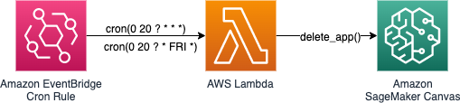

# Shutdown Amazon SageMaker Canvas on a Schedule

## :warning: **If you are looking for the official AWS repository**: I suggest you read through the "[Provision and manage ML environments with Amazon SageMaker Canvas using AWS CDK and AWS Service Catalog | AWS Machine Learning Blog](https://aws.amazon.com/it/blogs/machine-learning/provision-and-manage-ml-environments-with-amazon-sagemaker-canvas-using-aws-cdk-and-aws-service-catalog/)" and refer to the official aws-samples repository on GitHub.

Run this CDK template to automatically shutdown Amazon SageMaker Canvas apps. You can choose whether to shutdown every day at 8PM or on Fridays at 8PM. Default behaviour: Friday at 8PM.

## Steps to deploy - AWS CDK

1. clone this repository
2. `python3 -m virtualenv .venv`
3. `source .venv/bin/activate`
4. `pip install -r requirements.txt`
5. `cdk deploy`
6. Enjoy!

## Steps to deploy - AWS CloudFormation

1. Download the [`template.yaml` file](https://raw.githubusercontent.com/dgallitelli/sagemaker-canvas-scheduled-shutdown/main/template.yaml)
2. Go to the AWS CloudFormation page to launch a new stack - [click here](https://console.aws.amazon.com/cloudformation/)
3. Create a new stack with new resources
4. Providing the template downloaded, and complete the parameters required
5. Enjoy!

## Steps to cleanup

Either execute `cdk destroy` from within this folder, or head over to the [AWS CloudFormation stacks](https://console.aws.amazon.com/cloudformation/home/stacks) page, and delete the `ScheduledCanvasShutdown` stack.
